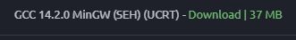

# Silent_Escape
A stealth escape game based on SFML 3.0 and C++ OOP concepts.

# documentation --> SFML 3.0
https://www.sfml-dev.org/documentation/3.0.0

# tutorials
https://www.sfml-dev.org/tutorials/3.0

# A little explanation and information
(This is to work in "VS code", not "Microsoft Visual studio")

1. Clone the repository as it is.
2. While main is open, press ctrl+shift+B for the build process.
3. Run the silent_escape.exe for the folder in file explorer that was cloned. 
4. All self-made header files(.hpp) goes to includes folder.
5. All sprites and spritesheets goes to assets folder. 
6. The executable and dlls are found in build folder.
7. Source files will be created in src folder.

# Contact me for more information!

# SFML 3.0 download procedure

1. Open this link: https://www.sfml-dev.org/download/sfml/3.0.0/#windows
2. select 
3. Now the set the path as in the task.json.
4. sfml will be working now working 

# Installation of Compiler
1. go to this site: https://www.msys2.org/ 
2. follow the procedure on the site 